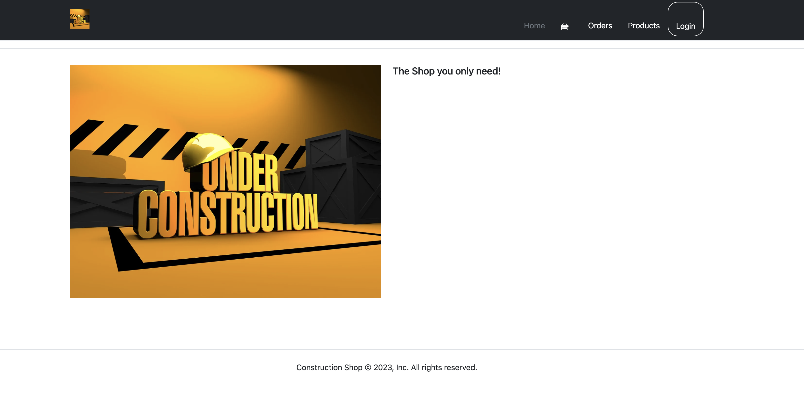

# Construction Equipments/ Tools E-Commerce Site 

A brief description of what this project does and who it's for

Binaa team
## Overview

The construction e-commerce “Aqar / Binaa” is a platform for construction shops and companies to show their products, equipment, and tools ..etc. for the customers online. 

The Bahraini market is lacking platform for the construction market. We believe that the platform is a step to move towards digitalizing the sector. 

## Project Diagram: 

## Platform Map: 

a. User: 

Is the customer or client of shops.

Consists of: 

- Email 
- Name 
- Phone number 
- Address 
- Type

b. Order:

Is the product to be either sold or rented.

c. Cart 

Is the collection of products to be either sold or rented by the user

- Consists of: 
  -  Date (end-start) 
  -  Order details 
  -  Status 

d. Products: 

Are the tools / equipment to be sold or rented by the shop 

- Consists of: 
  - Image 
  - Name
  - Price
  - Description 
  - Quantity 
  - Reviews 
  - Category 
  - Details 

e. Shop

Is the company or construction shop that will offer its products to the clients 
- Consists of:

  - Name 
  - Email
  - Phone
  - Address 

## Features

- Responsive site 
- Mobile Responsive
- User Profile 
- Shops 
- products 
- CRUD 

## Project Requirements

- Technology used: 
  - Node.js
  - Mongoose Database
  - Express 
  - EJS 
  - Multer 
  - dayjs 
  - express
  - express-ejs-layouts
  - express-session
  - passport
  - passport-google-oauth
  - Sign-up logging     functionality

  
## Screenshots

